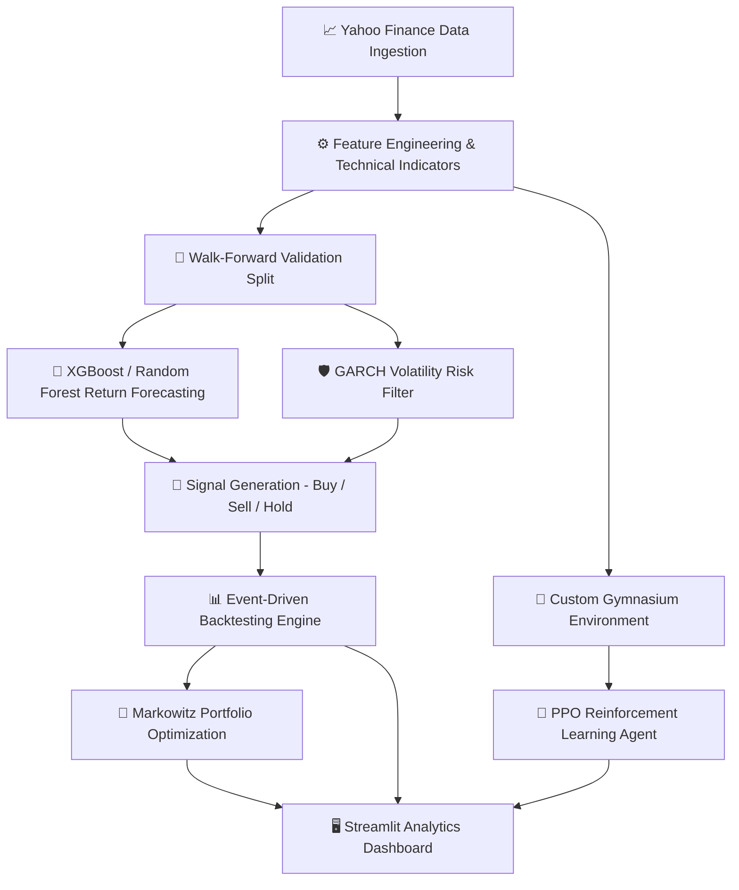

# 🚀 Autonomous AI Financial Trading & Portfolio System

[](https://www.python.org/)
[](https://streamlit.io/)
[](https://xgboost.readthedocs.io/)
[](https://stable-baselines3.readthedocs.io/)
[](LICENSE)

An institutional-grade, end-to-end quantitative trading system integrating **Machine Learning Return Forecasting, Deep Reinforcement Learning (PPO), Volatility Risk Control, Markowitz Portfolio Optimization, and Walk-Forward Validation**, accompanied by an interactive **Streamlit Visual Analytics Dashboard**.

---

## 📌 Executive Summary

The **AI Financial Trading System** is designed to eliminate emotional bias and maximize risk-adjusted returns in dynamic market environments. By leveraging market data from Yahoo Finance, the platform computes comprehensive technical indicators, forecasts returns using gradient boosted trees (XGBoost), applies GARCH-based volatility risk filters, trains autonomous trading agents via Proximal Policy Optimization (PPO), and optimizes multi-asset allocations via Modern Portfolio Theory (MPT).

---

## ✨ Key Features

### 🔮 Predictive Machine Learning Engine
- **XGBoost & Random Forest Regressors** for directional return prediction.
- **Optuna Hyperparameter Optimization** for automated model tuning.
- **Feature Engineering Pipeline**:
  - **Momentum & Trend**: RSI, MACD & Signal Line, EMA (10/20/50), SMA (10/20/50), Momentum.
  - **Volatility & Range**: Bollinger Bands (High/Low), Average True Range (ATR), Rolling Standard Deviation, Daily Price Range.
  - **Volume & Liquidity**: Volume Change %, Volume Moving Averages.
  - **Autoregressive Lags**: Multi-period lagged return features (Lag 1, 2, 3, 5).

### 🤖 Deep Reinforcement Learning (PPO)
- **Custom Gymnasium Trading Environment** simulating discrete position sizing, realistic account cash management, transaction costs, and portfolio liquidations.
- **Stable-Baselines3 Proximal Policy Optimization (PPO)** agent trained on high-dimensional feature spaces.
- **Reward Engineering** penalizing drawdown and rewarding risk-adjusted capital accumulation.

### 🛡️ Quantitative Risk Management
- **GARCH Volatility Forecasting** for dynamic regime detection.
- **Adaptive Risk Filtering**: Automatically neutralizes trading signals during high-volatility regimes exceeding historical variance thresholds.
- **Transaction Cost Modeling**: Deducts realistic execution fees (e.g., 10 bps per trade entry/exit).

### 💼 Portfolio Optimization & Asset Allocation
- **Modern Portfolio Theory (MPT) / Markowitz Mean-Variance Optimization**.
- Optimal weight calculation for multi-asset universes (e.g., `AAPL`, `MSFT`, `GOOG`).
- Efficient Frontier evaluation balancing expected return and portfolio variance.

### 📈 Backtesting & Walk-Forward Validation
- **Event-Driven & Vectorized Backtesting Engine**.
- Benchmark comparison against traditional **Buy & Hold** strategies.
- **Walk-Forward Cross-Validation** to prevent lookahead bias and overfitting.
- Metrics calculated: **Sharpe Ratio, Sortino Ratio, Max Drawdown, CAGR, Win Rate %, Profit Factor, MAE, and MSE**.

---

## 🏗️ System Architecture & Workflow



---

## 🖥️ Interactive Streamlit Dashboard

The system includes a dark-themed, responsive dashboard built with Streamlit and Plotly/Matplotlib, organized into modular views:

| View Module | Description |
| :--- | :--- |
| **🏠 Executive Overview** | High-level system KPI metrics, active asset summaries, and strategy performance snapshots. |
| **📊 Market Analysis** | Price history, candlestick visuals, technical indicator breakdown (RSI, MACD, Bollinger Bands). |
| **🔮 Machine Learning** | Real-time prediction comparison (Actual vs. Predicted) and XGBoost feature importance rankings. |
| **🛡️ Risk Analytics** | Volatility distribution, historical drawdown curves, and risk-filtered trading activity. |
| **📈 Backtesting Engine** | Strategy equity curve vs. Buy & Hold benchmark, drawdown profile, and trade log metrics. |
| **🤖 RL Agent (PPO)** | Agent reward convergence curves, policy actions, and reinforcement learning performance stats. |
| **💼 Portfolio Optimization** | Optimal multi-asset weight allocations, risk-return trade-off metrics, and asset correlations. |
| **ℹ️ System Info & About** | Technical architecture documentation, hyperparameter configurations, and model metadata. |

---

## 📂 Repository Structure

```text
AI-Financial-Trading-System/
├── .streamlit/
│   └── config.toml                 # Streamlit UI configuration & dark theme
├── backtesting/
│   ├── performance_metrics.py      # Sharpe, Sortino, Drawdown, CAGR calculations
│   └── strategy.py                 # Risk filter & signal application
├── config/
│   └── settings.py                 # Global system configuration & constants
├── dashboard/
│   ├── components/                 # Reusable UI components (Cards, Charts, Metrics, Tables, Sidebar)
│   ├── styles/                     # Dashboard styling & color tokens (theme.py)
│   ├── utils/                      # Data loaders, state management & formatting helpers
│   ├── views/                      # View pages (Home, Market, ML, Risk, Backtest, RL, Portfolio, About)
│   └── app.py                      # Main Streamlit Dashboard entry point
├── data/
│   ├── cache/                      # Cached raw market downloads
│   └── processed/                  # Feature-engineered dataset exports
├── features/
│   └── feature_engineering.py      # Technical indicator computation pipeline
├── models/
│   ├── hyperparameter_tuning.py   # Optuna optimization scripts
│   ├── portfolio_optimizer.py      # Markowitz mean-variance optimization
│   └── xgb_model.py                # XGBoost model definitions
├── outputs/
│   ├── charts/                     # Generated equity curves & feature importance charts
│   ├── predictions/                # Output prediction CSVs
│   └── reports/                    # Generated metrics logs & portfolio weight exports
├── risk/
│   └── volatility_model.py         # GARCH / Volatility modeling & risk controls
├── rl_agents/
│   ├── trading_env.py              # Custom Gymnasium financial trading environment
│   ├── train_rl.py                 # PPO model training pipeline
│   └── evaluate_rl.py              # Agent evaluation script
├── saved_models/                   # Trained model artifacts (.pkl, .zip)
├── validation/
│   └── walk_forward.py             # Walk-forward cross-validation engine
├── main.py                         # Complete end-to-end execution pipeline script
├── requirements.txt                # Project dependencies
└── README.md                       # Project documentation
```

---

## 🚀 Quickstart & Installation

### 1️⃣ Prerequisites
- Python **3.10** or higher installed.
- `git` version control system.

### 2️⃣ Clone Repository & Setup Virtual Environment

```bash
# Clone the repository
git clone https://github.com/Jeel-Pipaliya/AI-Financial-Trading-System.git
cd AI-Financial-Trading-System

# Create a virtual environment
python -m venv venv

# Activate the virtual environment
# On Windows (PowerShell):
.\venv\Scripts\Activate.ps1
# On Linux/macOS:
source venv/bin/activate
```

### 3️⃣ Install Dependencies

```bash
pip install --upgrade pip
pip install -r requirements.txt
```

---

## 💻 Usage & Execution

### Option A: Run End-to-End Pipeline
To run data downloading, feature engineering, walk-forward validation, XGBoost training, risk filtering, backtesting, portfolio optimization, and PPO RL agent training in one command:

```bash
python main.py
```

*Output artifacts (charts, metrics reports, prediction files, saved models) will be exported to `outputs/` and `saved_models/`.*

### Option B: Launch Interactive Dashboard
To launch the Streamlit web dashboard:

```bash
streamlit run dashboard/app.py
```

Then open `http://localhost:8501` in your browser.

---

## 📊 Key Evaluation Metrics

| Metric | Target / Description |
| :--- | :--- |
| **Sharpe Ratio** | Risk-adjusted return benchmarked against risk-free rate ($\ge 1.0$ desired). |
| **Sortino Ratio** | Risk-adjusted return measuring downside volatility specifically. |
| **Max Drawdown (MDD)** | Peak-to-trough drop in equity curve; assesses capital preservation. |
| **CAGR** | Compound Annual Growth Rate over the evaluation timeframe. |
| **Profit Factor** | Ratio of Gross Profits to Gross Losses ($> 1.0$ indicates profitability). |
| **Win Rate %** | Percentage of executed trades yielding positive return. |
| **Walk-Forward MAE/MSE** | Out-of-sample prediction accuracy across sliding time windows. |

---

## 🗺️ Future Roadmap

- [ ] **Multi-Asset Multi-Target Deep Learning**: LSTM & Transformer models for multi-ticker return prediction.
- [ ] **Live Execution API Integrations**: Interactive Brokers / Alpaca Paper Trading integration.
- [ ] **NLP Sentiment Analysis**: Real-time news headlines & social sentiment filtering (BERT/FinBERT).
- [ ] **Advanced RL Algorithms**: SAC (Soft Actor-Critic) & TD3 integration for continuous action spaces.
- [ ] **Real-time WebSockets**: Automated live data streaming and alert triggers.

---

## ⚠️ Disclaimer

> [!WARNING]
> This repository is developed **strictly for educational, academic, and research purposes**. 
> Financial trading involves substantial risk of capital loss. Nothing contained in this project constitutes financial, investment, or legal advice. Always conduct independent research and consult a licensed financial advisor before engaging in live trading.

---

## 👥 Authors & Contributors

- **Aayush Savaliya** - [*GitHub Profile*](https://github.com/Aayushh910)
- **Jeel Pipaliya** — [*GitHub Profile*](https://github.com/Jeel-Pipaliya)

*If you find this repository valuable, please consider giving it a ⭐ on GitHub!*